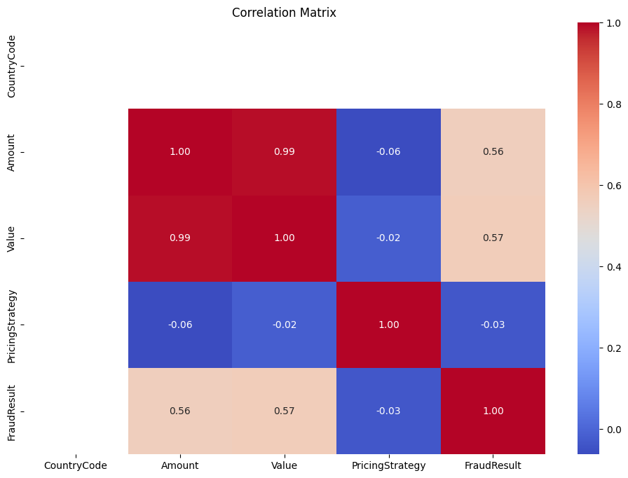
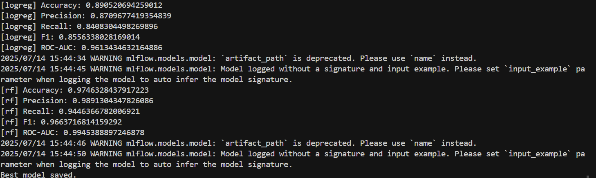
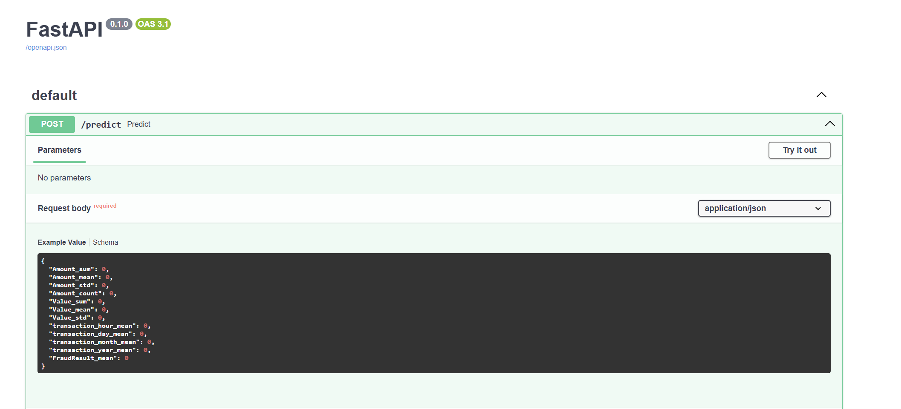

# B5W5: Credit Risk Probability Model for Alternative Data

A complete, end-to-end solution for building, evaluating, and deploying a credit risk probability model using alternative data. This project demonstrates best practices in data science, feature engineering, model training, MLOps, and API deployment for real-world financial risk assessment.

**GitHub Repository:** [YonatanBest/B5W5-Credit-Risk-Probability-Model-for-Alternative-Data](https://github.com/YonatanBest/B5W5-Credit-Risk-Probability-Model-for-Alternative-Data.git)

## Credit Scoring Business Understanding

### 1. Basel II Accord and Model Interpretability
The Basel II Accord emphasizes rigorous risk measurement and regulatory compliance for financial institutions. This requires credit risk models to be interpretable, transparent, and well-documented so that both internal stakeholders and regulators can understand, audit, and trust the model’s predictions. An interpretable model helps ensure that risk estimates are explainable and that the institution can justify lending decisions, which is critical for regulatory approval and risk management.

### 2. Proxy Variable for Default and Associated Risks
Since the dataset lacks a direct "default" label, we must create a proxy variable (e.g., using customer disengagement or RFM analysis) to approximate high-risk behavior. The main business risk is that this proxy may not perfectly represent true default risk, potentially leading to misclassification. If the proxy is poorly defined, the model may approve risky customers or reject good ones, impacting profitability and customer trust. Careful design and validation of the proxy are essential to minimize these risks.

### 3. Model Trade-offs: Simplicity vs. Performance
Simple, interpretable models (like Logistic Regression with Weight of Evidence) are preferred in regulated contexts because they are easier to explain and audit. However, they may not capture complex patterns as well as advanced models (like Gradient Boosting Machines). Complex models can offer higher predictive performance but are harder to interpret, which can be a regulatory and business risk. The key trade-off is between maximizing predictive accuracy and ensuring transparency, fairness, and compliance.

## Project Structure

```
credit-risk-model/
├── .github/workflows/ci.yml   # For CI/CD
├── data/                      # add this folder to .gitignore
│   ├── raw/                   # Raw data goes here 
│   └── processed/             # Processed data for training
├── notebooks/
│   └── 1.0-eda.ipynb          # Exploratory, one-off analysis
├── src/
│   ├── __init__.py
│   ├── data_processing.py     # Script for feature engineering
│   ├── train.py               # Script for model training
│   ├── predict.py             # Script for inference
│   ├── rfm_proxy.py           # Script for proxy target variable
│   └── api/
│       ├── __init__.py
│       ├── main.py            # FastAPI application
│       └── pydantic_models.py # Pydantic models for API
├── tests/
│   └── test_data_processing.py # Unit tests
├── Dockerfile
├── docker-compose.yml
├── requirements.txt
├── .gitignore
└── README.md
```

## EDA Insights

1. **Highly Skewed Transaction Values:**
   The `Amount` and `Value` columns are strongly right-skewed, with a small number of very large transactions. This suggests the need for scaling or transformation to prevent these outliers from dominating the model.

2. **Imbalanced Categorical Features:**
   Features such as `ProductCategory` and `ChannelId` are dominated by a few categories, while others are rare. Grouping or encoding strategies will be important for effective modeling.

3. **Missing Values in Key Columns:**
   Some features, notably `ProviderId` and `PricingStrategy`, contain missing values. These will require imputation or removal to ensure data quality.

4. **Strong Correlation Between Amount and Value:**
   The `Amount` and `Value` columns are highly correlated, as `Value` is the absolute value of `Amount`. One of these may be dropped to reduce redundancy.

5. **Presence of Outliers:**
   Boxplots reveal significant outliers in transaction amounts. These may be legitimate but should be carefully considered during feature engineering and model training.

## Feature Engineering

- Aggregated per-customer features such as total, mean, and standard deviation of transaction amounts and values.
- Extracted time-based features (hour, day, month, year) from transaction timestamps.
- Encoded categorical variables using one-hot encoding.
- Handled missing values with imputation strategies (median for numerics, most frequent for categoricals).
- Normalized numerical features to ensure comparability and robust model performance.

## Model Training and Evaluation

- Trained both Logistic Regression and Random Forest models using the engineered features.
- Evaluated models using accuracy, precision, recall, F1, and ROC-AUC metrics.
- Random Forest achieved the highest ROC-AUC (0.99), indicating strong predictive power for identifying high-risk customers.
- The most important features for risk prediction were transaction frequency, average transaction amount, and recency of last transaction.
- Outliers and missing values were handled through robust feature engineering and imputation strategies.

## API and Deployment

- The trained model and feature pipeline are served via a FastAPI application.
- The API exposes a `/predict` endpoint for real-time risk scoring of new customers.
- The project includes a Dockerfile and docker-compose.yml for containerized deployment.
- CI/CD is set up with GitHub Actions to ensure code quality and automated testing.

### Example Screenshots

> **Add your screenshots to the `screenshots/` folder and update the links below.**

- **EDA Summary:**  
  
- **Model Evaluation:**  
  
- **API Swagger UI:**  
  

## Instructions for Running the Project

1. **Clone the repository and install dependencies:**
   ```sh
   git clone https://github.com/YonatanBest/B5W5-Credit-Risk-Probability-Model-for-Alternative-Data.git
   cd B5W5-Credit-Risk-Probability-Model-for-Alternative-Data
   python -m venv venv
   venv\Scripts\activate  # On Windows
   pip install -r requirements.txt
   ```
2. **Prepare the data:**
   - Place the raw data in `data/raw/data.csv`.
3. **Generate processed data and proxy target:**
   ```sh
   python -m src.rfm_proxy
   ```
4. **Train the model:**
   ```sh
   python -m src.train
   ```
5. **Run unit tests (optional):**
   ```sh
   $env:PYTHONPATH = "."
   pytest
   ```
6. **Start the API:**
   ```sh
   uvicorn src.api.main:app --reload
   ```
   - Visit [http://127.0.0.1:8000/docs](http://127.0.0.1:8000/docs) to test the `/predict` endpoint.
7. **(Optional) Run with Docker:**
   ```sh
   docker-compose up --build
   ```

## References

- [Basel II Capital Accord](https://www.hkma.gov.hk/media/eng/doc/key-functions/financial-infrastructure/alternative_credit_scoring.pdf)
- [Credit Risk Modeling Resources](https://towardsdatascience.com/how-to-develop-a-credit-risk-model-and-scorecard-91335fc01f03)
- [Xente Challenge Dataset](https://www.kaggle.com/datasets/atwine/xente-challenge)
- [Weight of Evidence (WoE) and Information Value (IV)](https://pypi.org/project/woe/)
- [MLOps with MLflow](https://mlflow.org/)